# Diabetes Prediction Modeling Project  

# Predicting Diabetes in Patients: A Machine Learning Model  

A Machine Learning Project by Yiannis Pagkalos, Sami Chowdhury, Mei Kam Bharadwaj, Dhwani Patel, and Lauren Christiansen  

# Executive Summary  

Our project goal is to determine how key datapoints (BMI, high blood pressure, cholesterol, stroke, heart disease/attack, physical activity level, general health level, physical health level, difficulty walking scale, age, education level, income level) relate to the diagnosis of diabetes in different patients. We used this underlying data and created & trained a machine learning model to easily predict whether a patient would be diagnosed.

# Table of Contents
- [Installation & Usage](#installation--usage)
    - [File Structure](#file-structure)
    - [Prerequisites](#prerequisites)
    - [Setup](#setup)
- [Project Evolution - Data Pivot](#project-evolution---data-pivot)
- [Data Collection & Preprocessing](#data-collection--preprocessing)
    - [Initial Exploration](#initial-exploration)
    - [Preprocessing and Cleaning](#preprocessing-and-cleaning)
    - [Machine Learning Model Methodology](#machine-learning-model-methodology)
- [Analysis & Results](#analysis--results)
    - [Initial Machine Learning Models](#initial-machine-learning-models)
        - [Initial KNN Model](#initial-knn-model)
        - [Initial Logistic Regression Model](#initial-logistic-regression-model)
        - [Initial Decision Tree Model](#initial-decision-tree-model)
        - [Initial Random Forest Model](#initial-random-forest-model)
        - [Initial XG Boost Model](#initial-xg-boost-model)
    - [Hyptertuned Machine Learning Models](#hyptertuned-machine-learning-models)
        - [Hypertuned KNN](#hypertuned-knn)
        - [Hypertuned Logistic Regression](#hypertuned-logistic-regression)
        - [Hypertuned Decision Tree](#hypertuned-decision-tree)
        - [Hypertuned Random Forest](#hypertuned-random-forest)
        - [Hypertuned XG Boost](#hypertuned-xg-boost)
- [Challenges Encountered](#challenges-encountered)
- [Limitations and Considerations](#limitations-and-considerations)
    - [Data Limitations](#data-limitations)
    - [External Factors](#external-factors)
- [Summary of Findings](#summary-of-findings)
- [Potential Next Steps](#potential-next-steps)
- [Contributers](#contributors)
- [Acknowledgments](#acknowledgments)
- [Repository Structure](#repository-structure)


# Installation & Usage  


## File Structure


```
├── Resources/
├──── cleaned_encoded_scaled_data.csv
├──── diabetes_binary_5050split_health_indicators_BRFSS2015.csv
├── .gitignore
├── diabetes-prediction-modeling.ipynb
├── README.md
```


## Prerequisites

- Latest version of Python


- The following Python Libraries must be installed:
    1. **pandas** : needed for general data frame management
    2. **seaborn** : needed for creating correlation heat maps
    3. **matplotlib.pyplot** : needed for creating visualizations for the data inside the notebook
    3. **sklearn.preprocessing** : needed for preprocessing, including scaling and encoding, the data. Specifically import:
        - *OrdinalEncoder*
        - *StandardScaler*
    4. **sklearn.model_selection** : needed for helping divide the data for the models, and for fine-tuning the models. Specifically import:
        - *train_test_split*
        - *GridSearchCV*
    5. **sklearn.neighbors** : needed for building the K-Nearest-Neighbors machine learning model. Specifically import:
        - *KNeighborsClassifier*
    6. **sklearn.linear_model** : needed for building the Logistic Regression machine learning model. Specifically import:
        - *LogisticRegression*
    7. **sklearn.tree** : needed for building the Decision Tree Classifier machine learning model. Specifically import:
        - *DecisionTreeClassifier*
    8. **sklearn.ensemble** : needed for building the ensemble learning machine learning models (random forest). Specifically import:
        - *RandomForestClassifier*
    9. **xgboost** : needed for building the XG-Boost Classifier machine learning model. Specifically import:
        - *XGBClassifier*
    10. **sklearn.metrics** : needed for building some of the metrics needed to analyze the quality of the machine learning models and their performances. Specifically import:
        - *accuracy_score*
        - *confusion_matrix*
        - *classification_report*
        - *balanced_accuracy_score*
        - *roc_auc_score*
        - *roc_curve*
        - *PrecisionRecallDisplay*
        - *RocCurveDisplay*


- Git version control system


- Internet connection for data downloads


## Setup    

- Clone this repository: https://github.com/yiannisp1822/Project2_Diabetes.git

- Install required packages mentioned in the prerequisites

- Launch Jupyter Notebook

- Download required datasets and ensure it is in the **Resources/** directory. The dataset can be found [at this link](https://www.kaggle.com/datasets/alexteboul/diabetes-health-indicators-dataset/data) 

- Verify file integrity using provided checksums

# Project Evolution - Data Pivot  

## Initial Direction

Originally, we began our data exploration with [this specific dataset on Kaggle](https://www.kaggle.com/datasets/uciml/pima-indians-diabetes-database) from the National Institute of Diabetes and Digestive and Kidney Diseases. This data was eventually abandoned since it contained less than 1000 rows, and so had a very small volume and would not produce strong machine learning models.  
  
  
The next dataset we looked at was found [at this Kaggle link](https://www.kaggle.com/datasets/iammustafatz/diabetes-prediction-dataset) that also was a collection of medical and demographic data from patients, along with their diabetes status. One of the most interesting points about this dataset was that it included H1BC, a valuable datapoint that could improve the machine learning model as this factor is an important one used by doctors to determine if a patient has diabetes. However, we decided against using this dataset since we could not verify the actual source for this dataset, which could lead to doubt as to whether our data or machine learning models created from this dataset would be vaild and noteworthy.  

In the end, we decided to use this data [from the Behavioral Risk Factor Surveillance System (BRFSS)](https://www.kaggle.com/datasets/alexteboul/diabetes-health-indicators-dataset/data). The survey is a health-related telephone survey that is collected annually by the CDC. It is an annual survey that has been collected since 1984 and the features are either questions asked of participants or variables calculated based on their responses. We will use this dataset to create a machine learning model that predicts, based on the given data, whether a person has diabetes or does not.

# Data Collection & Preprocessing

## Initial Exploration

The first thing we explored when going through the data was the specific feature variables present in the dataset. Below is a summary of all the features in the data:

1. **Diabetes_binary**: 0 = no diabetes, 1 = prediabetes or diabetes
2. **HighBP**: 0 = no high, BP 1 = high BP
3. **HighChol**: 0 = no high cholesterol, 1 = high cholesterol
4. **CholCheck**: 0 = no cholesterol check in 5 years, 1 = yes cholesterol check in 5 years
5. **BMI**: Body Mass Index of the person questioned.
6. **Smoker**: Have you smoked at least 100 cigarettes in your entire life? [Note: 5 packs = 100 cigarettes] 0 = no, 1 = yes
7. **Stroke**: (Ever) had a stroke; 0 = no, 1 = yes
8. **HeartDiseaseorAttack**: coronary heart disease (CHD) or myocardial infarction (MI); 0 = no, 1 = yes
9. **PhysActivity**: physical activity in past 30 days - not including job; 0 = no, 1 = yes
10. **Fruits**: Consume Fruit 1 or more times per day; 0 = no, 1 = yes
11. **Veggies**: Consume Vegetables 1 or more times per day; 0 = no, 1 = yes
12. **HvyAlcoholConsump**: Heavy drinkers (adult men having more than 14 drinks per week and adult women having more than 7 drinks per week) 0 = no, 1 = yes
13. **AnyHealthcare**: Have any kind of health care coverage, including health insurance, prepaid plans such as HMO, etc. 0 = no, 1 = yes
14. **NoDocbcCost**: "Was there a time in the past 12 months when you needed to see a doctor but could not because of cost?" 0 = no, 1 = yes
15. **GenHlth**: "Would you say that in general your health is?": scale 1-5; 1 = excellent, 2 = very good, 3 = good, 4 = fair, 5 = poor
16. **MentHlth**: "Now thinking about your mental health, which includes stress, depression, and problems with emotions, for how many days during the past 30 days was your mental health not good?" scale 1-30 days
17. **PhysHlth**: "Now thinking about your physical health, which includes physical illness and injury, for how many days during the past 30 days was your physical health not good?" scale 1-30 days
18. **DiffWalk**: "Do you have serious difficulty walking or climbing stairs?" 0 = no, 1 = yes
19. **Sex**: 0 = female, 1 = male
20. **Age**: 13-level age category (_AGEG5YR see codebook) 1 = 18-24 9 = 60-64 13 = 80 or older
    - 1 = Age 18 to 24
    - 2 = Age 25 to 29
    - 3 = Age 30 to 34
    - 4 = Age 35 to 39
    - 5 = Age 40 to 44
    - 6 = Age 45 to 49
    - 7 = Age 50 to 54
    - 8 = Age 55 to 59
    - 9 = Age 60 to 64
    - 10 = Age 65 to 69
    - 11 = Age 70 to 74
    - 12 = Age 75 to 79
    - 13 = Age 80 or older 
21. **Education**: Education Level
    - 1 = Never attended school or only kindergarten
    - 2 = Grades 1 through 8 (Elementary)
    - 3 = Grades 9 through 11 (Some high school)
    - 4 = Grade 12 or GED (High school graduate)
    - 5 = College 1 year to 3 years (Some college or technical school)
    - 6 = College 4 years or more (College graduate)
22. **Income**: Income Scale
    - 1 = Less than $10,000
    - 2 = Less than $15,000 ($10,000 to less than $15,000)
    - 3 = Less than $20,000 ($15,000 to less than $20,000)
    - 4 = Less than $25,000 ($20,000 to less than $25,000)
    - 5 = Less than $35,000 ($25,000 to less than $35,000)
    - 6 = Less than $50,000 ($35,000 to less than $50,000)
    - 7 = Less than $75,000 ($50,000 to less than $75,000)
    - 8 = $75,000 or more

Initially, we created a correlation heatmap to figure out how each variable affected the target variable of someone having diabetes or not. Below in **Fig. 1** we show this heatmap. 

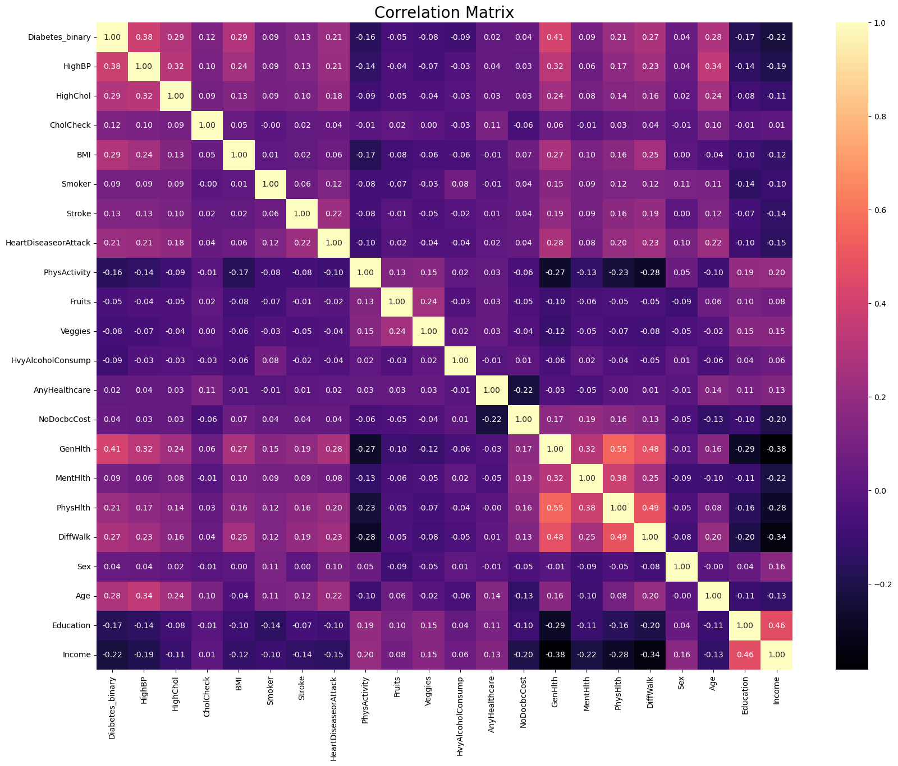

- **Fig 1.1: Correlation Heatmap of each feature to the target diabetes indicator variable**

Based on the correlation heatmap, we decided to take out variables that had less than a 10% correlation to the target variable. This meant we were going to exclude the *'Smoker'*, *'Sex'*, *'Fruits'*, *'Veggies'*, *'NoDocbcCost'*, *'MentHlth'*, *'AnyHealthcare'*, and *'HvyAlcoholConsump'* fields since they would reduce the accuracy and efficiency of our future machine learning models. So we decided to take these fields out in our final analysis. 

## Preprocessing and Cleaning

We also checked to see how balanced the dataset was. To our benefit, this dataset on Kaggle was already balanced between 0 (not having diabetes) and 1 (prediabetic or diabetic). This meant we did not require performing any over or under sampling on the data. We also observed that when checking for nulls, there were none to be found in the dataset. This dataset was cleaned beforehand for nulls, making our further analysis much smoother.

Next, when reviewing some of the columns, we noticed that some of their groupings were very large. In particular, we looked at the *Age*, *Education*, and *Income* columns, and tried creating functions to replace their initial groupings with smaller groupings. However, as this resulted in some data loss, we decided in the end to keep these fields intact. 

The one column that we decided to move forward with encoding was the *BMI* column. As this was purely numerical, we decided to create a function that would group the values based on the BMI ranges and categories from the CDC, from Underweight to Obesity 3. We then used an ordinal encoder to group the data to prep it for the machine learning analysis.

After we decided that the BMI column would be encoded, we completed the following steps to prepare our data for the machine learning model analysis:

1. Remove the *'Smoker'*, *'Sex'*, *'Fruits'*, *'Veggies'*, *'NoDocbcCost'*, *'MentHlth'*, *'AnyHealthcare'*, and *'HvyAlcoholConsump'* fields.
2. Split the data into training and testing datasets.
3. Create a function that replaced the original BMI values with their CDC grouped labels.
4. Encode the BMI column based on the training dataset.
5. Group the unencoded data with the encoded BMI column.
6. Scale the data based on the training dataset. 


## Machine Learning Model Methodology

We decided to use the following five machine learning models to try and analyze our dataset:

1. K-Nearest-Neighbors
2. Logistic Regression
3. Decision Tree Classifier
4. Random Forest Classifier
5. XGBoost Classifier

Our initial predictions were that the last two ensemble learning models would yield the highest accuracies. 

# Analysis & Results

After exploring the data and how certain features would affect whether someone did or did not have diabetes, we set out to answer the following questions regarding our dataset:

1. Which features are most strongly correlated to diabetes diagnoses, and how do they contribute to the model's predictions?
2. What are the models that will produce the best accuracy scores (Above 75%)?
3. How can we finetune the selected models to amplify accuracy scores?


## Initial Machine Learning Models

Below we have compiled the results of each of our initial machine learning models that we used on the dataset. Each has a summary table of its confusion matrix, classification report containing precision and recall, and accuracy scores, while also containing the ROC and Precision-Recall curves. 

### Initial KNN Model

**Table 1.1: KNN Confusion Matrix:**

|   | Predicted 0 | Predicted 1 |
| - | ----------- | ----------- |
| Actual 0s | 6217 | 2630 | 
| Actual 1s | 1912 | 6914 |


**Table 1.2: KNN Classification Report:**

| feature | precision | recall | f1-score | support | 
| ------- | --------- | ------ | -------- | ------- | 
| 0 | 0.76 | 0.70 | 0.73 | 8847 | 
| 1 | 0.72 | 0.78 | 0.75 | 8826 | 


**Table 1.3: KNN Accuracy Scores:**

|   | Score |
| - | ----- |
| Training Score  | 0.759822 | 
| Testing Score | 0.742998 | 
| Accuracy Score | 0.742998 |

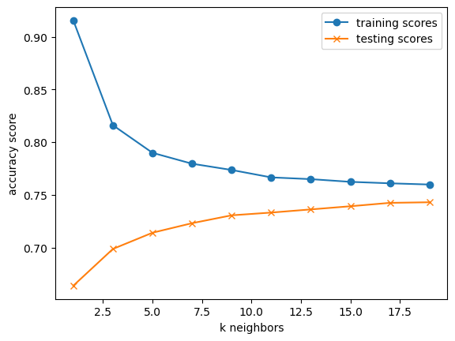

- **Fig 2.1: KNN Test/Train Score Line Graph**

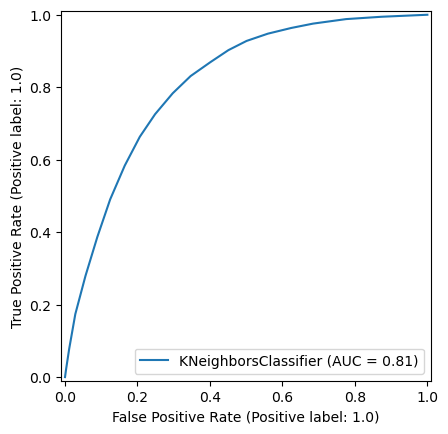

- **Fig 2.2: KNN ROC Curve Graph**

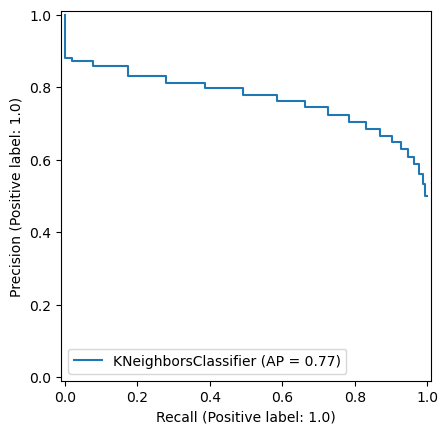

- **Fig 2.3: KNN Precision-Recall Line Graph**


### Initial Logistic Regression Model

**Table 2.1: Logistic Regression Confusion Matrix:**

|   | Predicted 0 | Predicted 1 |
| - | ----------- | ----------- |
| Actual 0s | 6513 | 2334 | 
| Actual 1s | 2045 | 6781 |


**Table 2.2: Logistic Regression Classification Report:**

| feature | precision | recall | f1-score | support | 
| ------- | --------- | ------ | -------- | ------- | 
| 0 | 0.76 | 0.74 | 0.75 | 8847 | 
| 1 | 0.74 | 0.77 | 0.76 | 8826 | 


**Table 2.3: Logistic Regression Accuracy Scores:**

|   | Score |
| - | ----- |
| Training Score  | 0.744714 | 
| Testing Score | 0.752221 | 
| Accuracy Score | 0.752221 |


- **Fig 3.1: Logistic Regression ROC Curve Graph**

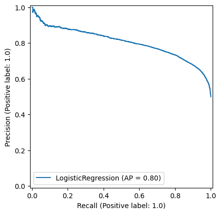

- **Fig 3.2: Logistic Regression Precision-Recall Line Graph**

### Initial Decision Tree Model

**Table 3.1: Decision Tree Confusion Matrix:**

|   | Predicted 0 | Predicted 1 |
| - | ----------- | ----------- |
| Actual 0s | 6263 | 2584 | 
| Actual 1s | 3248 | 5578 |


**Table 3.2: Decision Tree Classification Report:**

| feature | precision | recall | f1-score | support | 
| ------- | --------- | ------ | -------- | ------- | 
| 0 | 0.66 | 0.71 | 0.68 | 8847 | 
| 1 | 0.68 | 0.63 | 0.66 | 8826 | 


**Table 3.3: Decision Tree Accuracy Scores:**

|   | Score |
| - | ----- |
| Training Score  | 0.930176 | 
| Testing Score | 0.670005 | 
| Accuracy Score | 0.670005 |


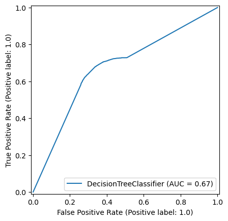

- **Fig 4.1: Decision Tree ROC Curve Graph**

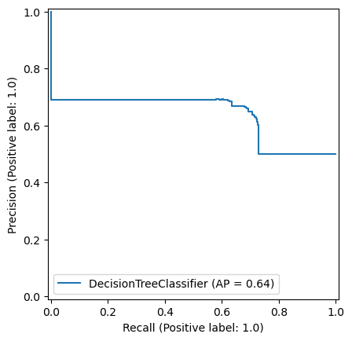

- **Fig 4.2: Decision Tree Precision-Recall Line Graph**

### Initial Random Forest Model

**Table 4.1: Random Forest Confusion Matrix:**

|   | Predicted 0 | Predicted 1 |
| - | ----------- | ----------- |
| Actual 0s | 6386 | 2461 | 
| Actual 1s | 2111 | 6715 |


**Table 4.2: Random Forest Classification Report:**

| feature | precision | recall | f1-score | support | 
| ------- | --------- | ------ | -------- | ------- | 
| 0 | 0.75 | 0.72 | 0.74 | 8847 | 
| 1 | 0.73 | 0.76 | 0.75 | 8826 | 


**Table 4.3: Random Forest Accuracy Scores:**

|   | Score |
| - | ----- |
| Training Score  | 0.734887 | 
| Testing Score | 0.741300 | 
| Accuracy Score | 0.741300 |


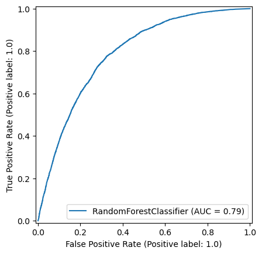

- **Fig 5.1: Random Forest ROC Curve Graph**

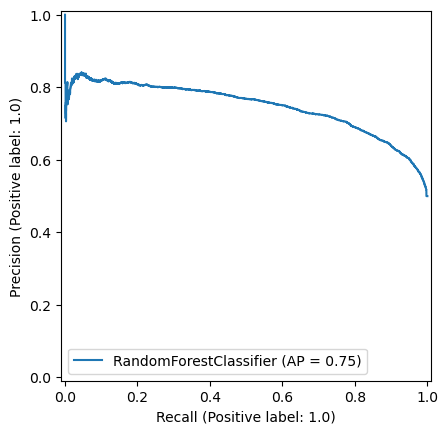

- **Fig 5.2: Random Forest Precision-Recall Line Graph**

### Initial XG Boost Model

**Table 5.1: XG Boost Confusion Matrix:**

|   | Predicted 0 | Predicted 1 |
| - | ----------- | ----------- |
| Actual 0s | 6322 | 2525 | 
| Actual 1s | 1782 | 7044 |


**Table 5.2: XG Boost Classification Report:**

| feature | precision | recall | f1-score | support | 
| ------- | --------- | ------ | -------- | ------- | 
| 0 | 0.78 | 0.71 | 0.75 | 8847 | 
| 1 | 0.74 | 0.80 | 0.77 | 8826 | 


**Table 5.3: XG Boost Accuracy Scores:**

|   | Score |
| - | ----- |
| Training Score  | 0.753918 | 
| Testing Score | 0.756295 | 
| Accuracy Score | 0.756295 |


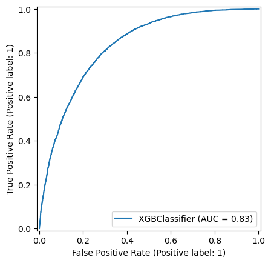

- **Fig 6.1: XG Boost ROC Curve Graph**

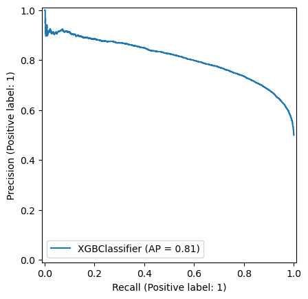

- **Fig 6.2: XG Boost Precision-Recall Line Graph**

### Key Findings From Pre-Tuned Models

- From the above, we can see that the XGB model is our best model to use for modeling this dataset. In addition, ungrouping the data improved the accuracies for almost every model, with the exception of the Decision Tree model. This may have to do with how the Decision Tree wasn't deeply set up in terms of parameters. Overall our models hovered around a 75% accuracy and ~ 70-80% precision and recall for the fields.

## Hyptertuned Machine Learning Models

Finally, we will explore the best parameters for our models shown above using the GridSearch method. Below are the parameter tables, accuracy and score tables, and classification reports for the optimal models for each type

### Hypertuned KNN

**Table 6.1: KNN Optimal Parameters:**

| Parameter | Value |
| --------- | ----- |
| Algorithm | auto |
| metric | manhattan |
| n_neighbors | 23 |
| weights| uniform |

**Table 6.2: KNN Accuracy and Score Table:**

| Metric | Value |
| -------- | -------- |
| Accuracy | 0.737585 |
| Score | 0.741923 |

**Table 6.3: KNN Classification Report**

| feature | precision | recall | f1-score | support | 
| ------- | --------- | ------ | -------- | ------- | 
| 0 | 0.76 | 0.70 | 0.73 | 8847 | 
| 1 | 0.72 | 0.78 | 0.75 | 8826 | 


### Hypertuned Logistic Regression

**Table 7.1: Logistic Regression Optimal Parameters:**

| Parameter | Value |
| --------- | ----- |
| C | 0.1 |
| max_iter | 100 |
| penalty | 12 |
| solver| liblinear |

**Table 7.2: Logistic Regression Accuracy and Score Table:**

| Metric | Value |
| -------- | -------- |
| Accuracy | 0.752221 |
| Score | 0.744431 |

**Table 7.3: Logistic Regression Classification Report**

| feature | precision | recall | f1-score | support | 
| ------- | --------- | ------ | -------- | ------- | 
| 0 | 0.76 | 0.74 | 0.75 | 8847 | 
| 1 | 0.74 | 0.77 | 0.76 | 8826 | 

### Hypertuned Decision Tree

**Table 8.1: Decision Tree Optimal Parameters:**

| Parameter | Value |
| --------- | ----- |
| max_depth | 10 |
| max_features | None |
| min_samples_leaf | 10 |
| min_samples_split| 5 |

**Table 8.2: Decision Tree Accuracy and Score Table:**

| Metric | Value |
| -------- | -------- |
| Accuracy | 0.741244 |
| Score | 0.735189 |

**Table 8.3: Decision Tree Regression Classification Report**

| feature | precision | recall | f1-score | support | 
| ------- | --------- | ------ | -------- | ------- | 
| 0 | 0.75 | 0.73 | 0.74 | 8847 | 
| 1 | 0.73 | 0.76 | 0.74 | 8826 |

### Hypertuned Random Forest

**Table 9.1: Random Forest Optimal Parameters:**

| Parameter | Value |
| --------- | ----- |
| max_depth | 11 |
| n_estimators | 500 |

**Table 9.2: Random Forest Accuracy and Score Table:**

| Metric | Value |
| -------- | -------- |
| Accuracy | 0.753635 |
| Score | 0.747411 |

**Table 9.3: Random Forest Classification Report**

| feature | precision | recall | f1-score | support | 
| ------- | --------- | ------ | -------- | ------- | 
| 0 | 0.77 | 0.72 | 0.74 | 8847 | 
| 1 | 0.74 | 0.79 | 0.76 | 8826 | 

### Hypertuned XG Boost

**Table 10.1: XG Boost Optimal Parameters:**

| Parameter | Value |
| --------- | ----- |
| max_depth | 3 |
| n_estimators | 100 |
| learning_rate | 0.2 |

**Table 10.2: XG Boost Accuracy and Score Table:**

| Metric | Value |
| -------- | -------- |
| Accuracy | 0.755107 |
| Score | 0.748279 |

**Table 10.3: XG Boost Classification Report**

| feature | precision | recall | f1-score | support | 
| ------- | --------- | ------ | -------- | ------- | 
| 0 | 0.78 | 0.71 | 0.74 | 8847 | 
| 1 | 0.74 | 0.80 | 0.76 | 8826 | 


# Challenges Encountered

1. **Potential of false negatives and false positives given modeling accuracy scores** 

- This can be quite the challenge when implementing this model on real data, as someone who implements the final model would have to determine if they are acceptable with the degree of error for falsely determining if someone does or does not have diabetes.

2. **Qualitative vs quantitative data challenges**

- Some of the data needed to predict if someone has or does not have diabetes is not present in this dataset, such as someone's diabetes pedigree or the measure of someone's HbA1C level. Both of these values were present in other datasets with less quality, but would have been a boon in this dataset.

3. **Potential dangers of self-reported data**

- The data used in this survey was self-reported by participants. With that fact in mind, some of the data could be embellished to make the participant seem healthier than they were, which would muddy the classification of someone having diabetes or not. As such, it is a key note that must be considered when applying this model to real-life data.  

4. **Data accuracy**

- Building on the previous point, knowing how the data was collected is important as well. Since it was a survey, it is important to understand how the data was logged and collected from participants, whether through the phone or through a webform. 


# Limitations and Considerations

## Data Limitations

Since the data used to build the model relied on self-reported data, one has to be extremely careful when applying the model. There could have been some patients who lied about their health and would therefore cause some of the classifications to be falsely matched. Since this is not easily detectable in the data, one must assume that our data used to build the model was entirely truthful, which carries some doubt.

## External Factors

When thinking about the possible healthcare system adaptations, it is important to realize that applying this model would require alot of features and known factors from patients. Most of the data has to be collected from the patient themselves to verify the data, or must be inferred. Our model requires a great deal of personal data from a patient in order to determine if someone has diabetes or not. 

In addition, our model was not able to fully explore how socioeconomic factors influence whether someone has diabetes or not. Some of these features were cut when performing the analysis based on an initial correlation heat map analysis. Thus, it would be wise in future applications to implement all the features into future models, since combined with principal component analysis could determine how much each feature truly affects whether someone has diabetes or not.

# Summary of Findings

The bar chart below provides a summary of our models and their respective grouped accuracies, ungrouped accuracies, and grid-tuned accuracies.

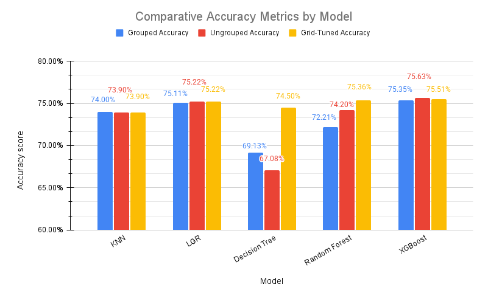

- **Fig 7.1: Comparative Accuracy Metrics by Model**

After performing the fine-tuning of our machine learning models for the dataset, these were the highest metrics across all models:

1. The model that had the highest precision **[0.78]** for feature 0 (not diabetes) was the XGBoost Model
2. The models that had the highest precision **[0.74]** for feature 1 (pre-diabetic or diabetic) were the Logistic Regression, Random Forest, XGBoost, and Adaptive Boost models
3. The model that had the highest recall **[0.74]** for feature 0 (not diabetes) was the Logistic Regression Model
4. The model that had the highest recall **[0.80]** for feature 1 (pre-diabetic or diabetic) was the XGBoost Model
5. The models that had the best F1-score **[0.75]** for feature 0 (not diabetes) were the Logistic Regression and Adaptive Boost Models
6. The models that had the best F1-score **[0.76]** for feature 1 (pre-diabetic or diabetic) were the Logistic Regression, Random Forest, XGBoost, and Adaptive Boost Models.

From these results we can make a few conclusions:

- The KNN model was one of the worst models for our dataset. Even with fine-tuning it did not perform as well even when fine-tuned. The same goes for the Decision Tree. Our dataset required a more group-boosting machine learning algorithm to predict the target variable.  


- We can see that the best model overall was the XGBoost model as it had some of the highest statistics in the classification report across all models. It also had the highest accuracy and score, each respectively being **0.755107** and **0.748279**. This will be the model we will use as our final model for predicting if someone is diabetic or not with the feature set we were given. Despite the fine-tuning, we found that our initial XGBoost parameters produced the highest accuracy score, so that will be the model being used going forward. A summary of its parameter table, accuracy table, confusion matrix, and classification report are below.

**Table 11.1: XG Boost Optimal Parameters:**

| Parameter | Value |
| --------- | ----- |
| max_depth | 3 |
| n_estimators | 1000 |
| learning_rate | 0.05 |

**Table 11.2: XG Boost Accuracy Table:**

| Metric | Value |
| -------- | -------- |
| Accuracy | 0.756295 |

**Table 11.3: XG Boost Confusion Matrix:**

|   | Predicted 0 | Predicted 1 |
| - | ----------- | ----------- |
| Actual 0s | 6322 | 2525 | 
| Actual 1s | 1782 | 7044 |

**Table 11.4: XG Boost Classification Report**

| feature | precision | recall | f1-score | support | 
| ------- | --------- | ------ | -------- | ------- | 
| 0 | 0.78 | 0.71 | 0.75 | 8847 | 
| 1 | 0.74 | 0.80 | 0.77 | 8826 | 


# Potential Next Steps:

- We would explore more datasets that include health indicators such as HbA1C (hemoglobin A1C) and fast blood sugar test (FBS). 

- HbA1C test measures the average blood sugar (glucose) level over the past 60-90 days.
 
- A fasting  blood sugar test measures the blood sugar levels first thing in the morning before the patient breaks their fast. If the patient’s blood sugar is high, then it indicates that patient has difficulties breaking down sugar in their body. 

- It is best to look at a dataset that includes both HbA1C and FBS data. HbA1C tests are less sensitive compared to the FBS test, but provides a more comprehensive story on the patient’s blood sugar over a period of months. 

- In practice, both tests are used in the office to get a more accurate diagnosis of diabetes.


# Contributors  
- [Yiannis Pagkalos](https://github.com/yiannisp1822): Project Lead
- [Sami Chowdhury](https://github.com/SamiC2): Data Sourcing, Data Cleaning, Methodology
- [Mei Kam Bharadwaj](https://github.com/meikaykam): Documentation, Data Modeling
- [Dhwani Patel]: Data Visualization
- [Lauren Christiansen](https://github.com/lmc5440): Data Visualization, Data Grouping


# Acknowledgments
- Data providers: Kaggle (Alex Teboul)
- Academic advisors
- CDC and its annual Behavioral Risk Factor Surveillance System (BRFSS)

# Repository Structure

```
├── graphics/
├──── fig1.1_correlation_heatmap.png
├──── fig2.1_kneighbors_accscore.png
├──── fig2.2_knn_roc.png
├──── fig2.3_knn_precision_recall.png
├──── fig3.1_lgr_roc.png
├──── fig3.2_lgr_precision_recall.png
├──── fig4.1_dtree_roc.png
├──── fig4.2_dtree_precision_recall.png
├──── fig5.1_rfc_roc.png
├──── fig5.2_rfc_precision_recall.png
├──── fig6.1_xgb_roc.png
├──── fig6.2_xgb_precision_recall.png
├──── fig7.1_Comparative_Accuracy_Metrics__Model.png
├── Resources/
├──── cleaned_encoded_scaled_data.csv
├──── diabetes_binary_5050split_health_indicators_BRFSS2015.csv
├── .gitignore
├── diabetes-prediction-modeling.ipynb
├── README.md
```
